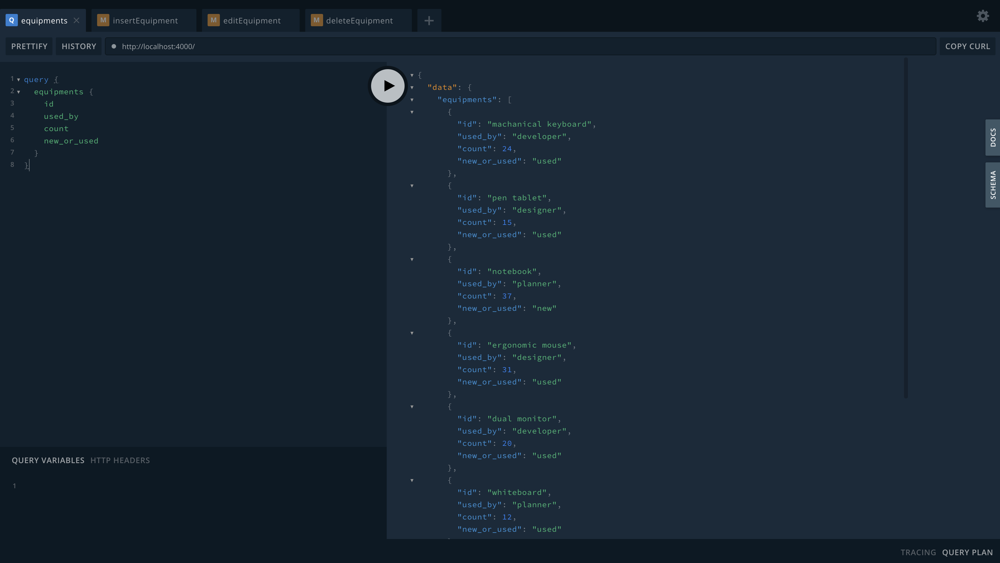
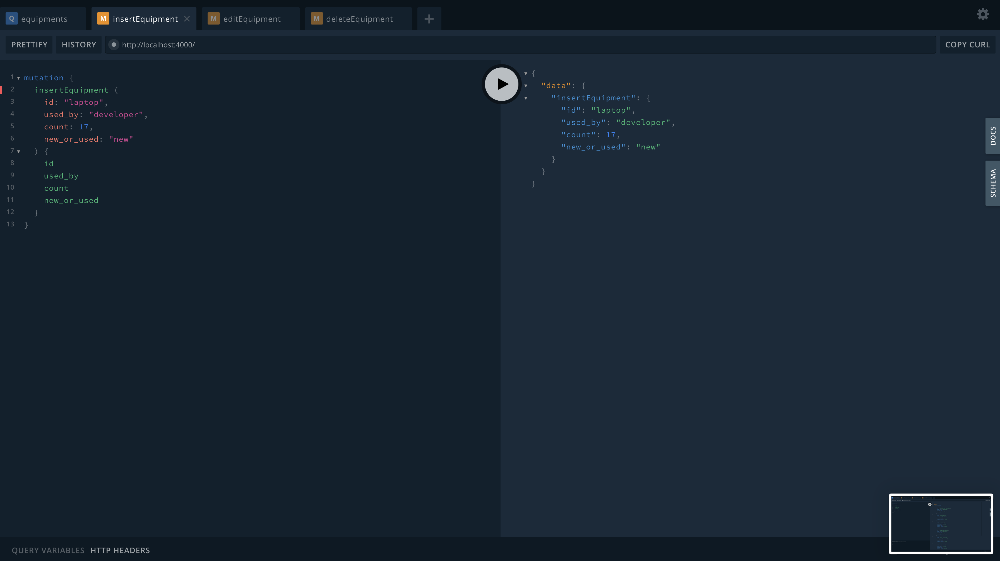
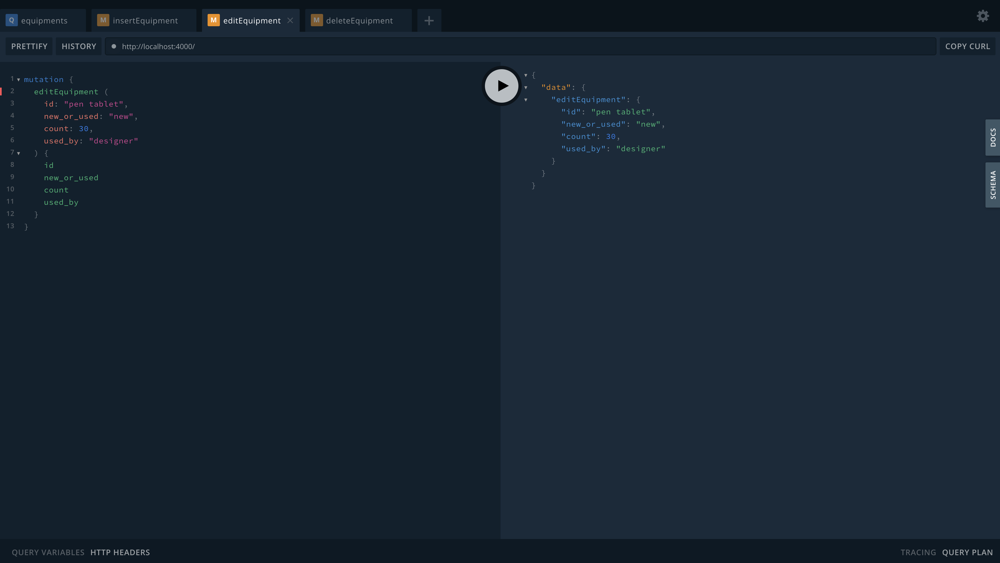
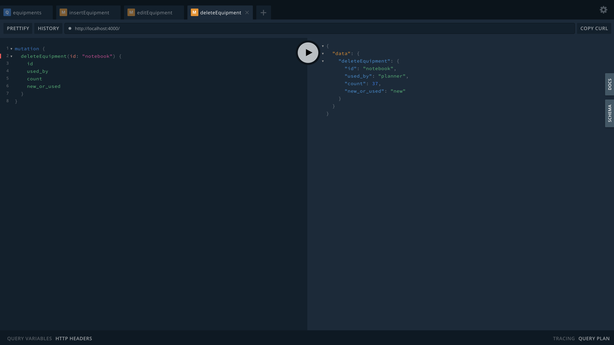

# GraphQL/Apollo

## ApolloServer

typeDef와 resolver를 인자로 받아 서버를 생성.

- typeDef
    - GraphQL 명세에서 사용될 데이터, 요청의 타입 지정
    - **gql**(template literal tag)로 생성됨
     
- resolver
    - 서비스의 액션들을 함수로 지정
    - 요청에 따라 데이터를 반환, 입력, 수정, 삭제
    
- GraphQL Playgroud
    - 작성한 GraphQL type, resolver 명세확인
    - 데이터 요청 및 전송 테스
```
// index.js
const database = require('./database');
const { ApolloServer, gql } = require('apollo-server');

const typeDefs = gql`
  type Query {
    teams: [Team]
    team(id: Int): Team
    equipments: [Equipment]
    supplies: [Supply]
  }
  type Mutation {
    insertEquipment(
      id: String
      used_by: String
      count: Int
      new_or_used: String
    ): Equipment
    editEquipment(
      id: String
      used_by: String
      count: Int
      new_or_used: String
    ): Equipment
    deleteEquipment(id: String): Equipment
  }
  type Team {
    id: Int
    manager: String
    office: String
    extension_number: String
    mascot: String
    cleaning_duty: String
    project: String
    supplies: [Supply]
  }
  type Equipment {
    id: String
    used_by: String
    count: Int
    new_or_used: String
  }
  type Supply {
    id: String
    team: Int
  }
`
const resolvers = {
  Query: {
    teams: () => database.teams
      .map((team) => {
        team.supplies = database.supplies
          .filter((supply) => {
            return supply.team === team.id
          })
        return team
      }),
    team: (parent, args, context, info) => database.teams.filter(team => team.id === args.id)[0],
    equipments: () => database.equipments,
    supplies: () => database.supplies
  },
  Mutation: {
    deleteEquipment: (parent, args, context, info) => {
      const deleted = database.equipments
        .filter((equipment) => {
          return equipment.id === args.id
        })[0]
      database.equipments = database.equipments
        .filter((equipment) => {
          return equipment.id !== args.id
        })
      return deleted
    },
    editEquipment: (parent, args, context, info) => {
      return database.equipments.filter((equipment) => {
        return equipment.id === args.id
      }).map((equipment) => {
        Object.assign(equipment, args)
        return equipment
      })[0]
    },
    insertEquipment: (parent, args, context, info) => {
      const inserted = database.equipments.push(args)
      return args
    }
  }
}

const server = new ApolloServer({ typeDefs, resolvers })
server.listen().then(({ url }) => {
  console.log(`🚀  Server ready at ${url}`)
})
```
```
// 파일 실행
npm start
```


## GraphQL Docs
#### Query


#### Mutation-추가


#### Mutation-수정


#### Mutation-삭제

